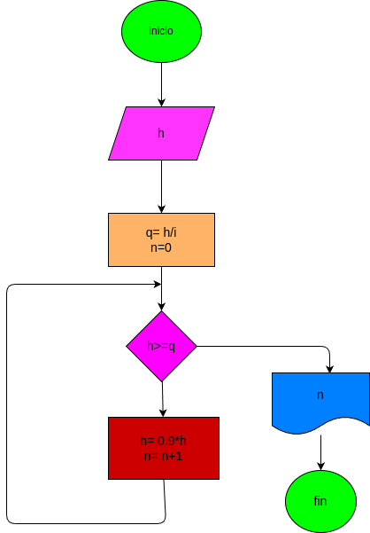

# calcular-altura

una pelota se deja caer desde una altura h, y en cada rebote sube el  10% menos que el anterior.hacer el diagrama de flujo y el programa en python,que lea h,y que calcule el prima en cual rebote la pelota no alcanza a subir la 5 parte de la altura inicial

## analisis

### input

h

q=h/5

n=0

## processing

h>= q:
h = 0.9 * h

n = n + 1

### output

n

### diseño

 